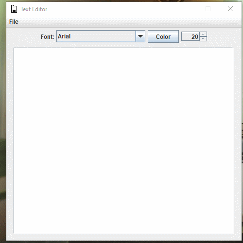

<h1 align="center">Text Editor 📃</h1>

## Description
I Developed a simple text editor with java, program edit the font and size and the color. save, open and close txt files. 



## How to use

````
# Clone Git Repository
git clone https://github.com/YoruHinda/Text-Editor.git
````

````
# Enter Directory
cd texteditor
````

````
# Run .jar file
java -jar texteditor.jar
````